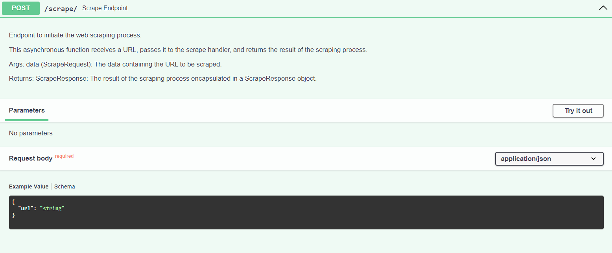
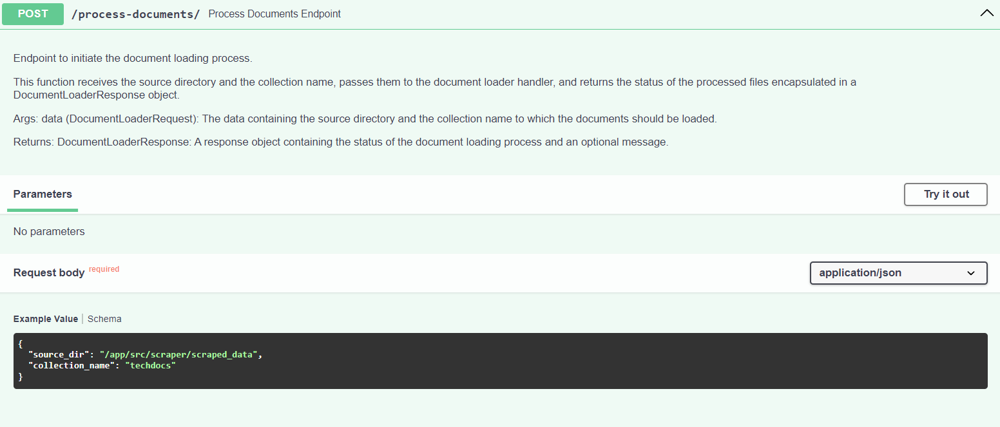
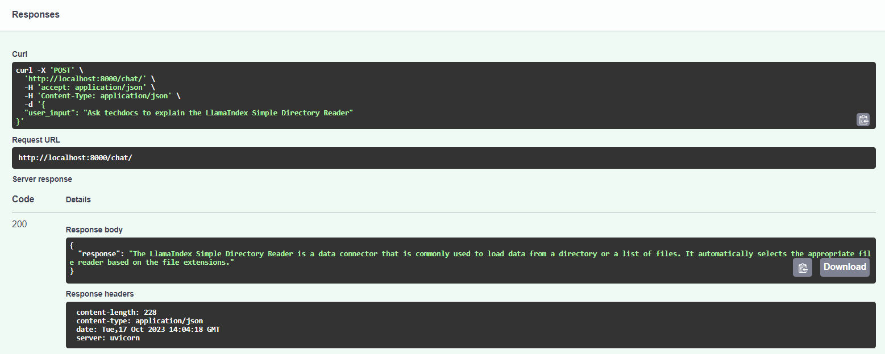

# 🤖 rag_bot - Retrieval Augmented Generative Chatbot


Welcome to `rag_bot`, a platform designed to facilitate the development of advanced conversational agents using retrieval augmented generation (RAG). This project integrates frameworks like FastAPI, Docker, LangChain, and LlamaIndex to provide a robust platform for creating chatbots that can access and reference external knowledge for more informed and contextual conversations.

## 🎯 **Purpose and Value**

The `rag_bot` project is a solutions accelerator, aiming to enable developers to efficiently build and deploy RAG chatbots that can:
- Engage in dynamic and enriched conversations powered by large language models.
- Retrieve and utilize relevant information from custom knowledge sources.
- Continuously adapt and learn from new conversations and information sources.

This platform is versatile and can be applied across various industries including customer support, e-commerce, finance, and more, to deliver insightful and factual interactions.

## 🌐 **Overview**

`rag_bot` offers a dev-ready architecture, allowing for the integration of modern technologies and frameworks. It is designed to enable chatbots to have enriched and contextually aware conversations by leveraging external knowledge, making it a valuable tool for developing advanced conversational agents.

## 🛠️ **Customization and Adaptability**

`rag_bot` is built with adaptability in mind, offering various customization options. It allows for the integration of additional data sources, experimentation with different language models, development of new tools, refinement of prompts, and creation of custom graphical interfaces to meet specific requirements and use cases.

## 🚀 Getting Started

The following sections will provide detailed guides and instructions on how to get started with `rag_bot`, covering prerequisites, setup, deployment, and usage. Explore the architecture, features, and customization options to build advanced conversational agents.

### Prerequisites

To use this project, you will need:

- Docker and Docker Compose installed  
- Python 3.7+
- An OpenAI API key

### Setup  

To set up the project:

1. Clone this repository to your local machine.

2. Rename `key.env.example` to `key.env` and add your OpenAI API key.  

3. In `docker-compose.yml`, update the `volumes` path for `RAG_BOT_QDRANT` to a local folder where you want persistent storage for the vector database.

4. Create needed directories for persistant storage
   ```bash
   mkdir -p .data/qdrant/
   ```

4. Build the Docker images:
   ```bash
    docker-compose build
    ```
5. Start the services:
   ```bash
   docker-compose up -d
   ```
The services will now be running.

## 🚢 **Deployment and Usage**
Once the Docker containers are up and running, you can start interacting with the bot via:

- The **interactive Swagger docs** at [http://localhost:8000/docs](http://localhost:8000/docs)
- The **Gradio Chat Interface** at [http://localhost:7860](http://localhost:7860)
- The **Qdrant Web Interface** at [http://localhost:6333/dashboard](http://localhost:6333/dashboard)

### Build the TechDocs Collection
1. **Scrape Documents:**
    - Go to the FastAPI server by navigating to the interactive Swagger docs at [http://localhost:8000/docs](http://localhost:8000/docs).
    - Use the `scrape` endpoint to scrape content from a specified URL. You will need to provide the URL you want to scrape in the request body.
    - The `scrape` endpoint will return the scraped content which will be processed in the next step.


2. **Create a Vector Index:**
    - Use the `process-documents` endpoint to create a vector index from the scraped content.
    - In case the `techdocs` collection does not exist, the `process-documents` endpoint will create one for you.
    - This endpoint will process the scraped documents, create a vector index, and load it into Qdrant.

3. **Interact with Processed Documents:**
    - Now that the documents are processed and loaded into Qdrant, you can start interacting with them.
    - Try chatting with the documents via the Gradio Chat Interface at [http://localhost:7860](http://localhost:7860).
    - The bot should automatically check the `techdocs` collection for technical information while responding to your queries. If it doesn't, you can instruct the bot by typing "check techdocs" in the chat interface.



## 🏗 **Architecture Overview**

The rag_bot architecture consists of the following key components:

- FastAPI - High performance REST API framework. Handles HTTP requests and routes them to application logic.
- Gradio - Interface for interacting with the bot via GUI.
- Qdrant - Vector database for storing document embeddings and enabling similarity search.
- AgentHandler - Orchestrates the initialization and execution of the conversational agent.
- Scraper - A tool that scrapes a web page and converts it to markdown.
- Loader - A tool that loads content from the scrped_data directory to a VectorStoreIndex
- Tools - Custom tools that extend the capabilities of the agent.

## ⚙️ **Bot Infrastructure**
Let's take a closer look at some of the key bot infrastructure components:

### FastAPI
FastAPI provides a robust web framework for handling the API routes and HTTP requests/responses.

Some key advantages:

- Built on modern Python standards like type hints and ASGI.
- Extremely fast - benchmarked to be faster than NodeJS and Go.
- Automatic interactive docs using OpenAPI standards.

In this project, main.py initializes the application and sets up the /chat endpoint which is the gateway for users to interact with the bot. Functionality can be tested directly via the docs interface:


### Gradio
Gradio serves as the interactive graphical interface allowing users to easily interact with the chatbot, providing a user-friendly way to visualize and test the bot's capabilities.


### Qdrant
Qdrant is a vector database optimized for ultra-fast similarity search across large datasets. It is used in this project to store and index document embeddings, enabling the bot to quickly find relevant documents based on a search query or conversation context.


## 🔧 **Custom Components**
### AgentHandler

`AgentHandler` is a central class, designed to initialize and manage the conversational agent within the `rag_bot` framework. It aims to provide developers with a clear and efficient way to handle the conversational agent's components and interactions.

#### Initialization and Configuration
- **`_initialize()`:** Orchestrates the initialization of all the components required for the agent, ensuring each element is set up correctly.
- **`_setup_config_and_env()`:** Loads configurations and sets up environment variables, providing a context for the agent's operation.

#### OpenAI Model Management
- **`_setup_openai()`:** Initializes the OpenAI model based on loaded configurations. It includes error handling to log and raise exceptions if any issues occur during initialization.

#### Memory Management
- **`_setup_memory()`:** Establishes the conversation buffer memory for maintaining chat history, enabling contextual conversations.

#### Prompt Template Management
- **`_load_prompt_templates()`:** Loads the prompt templates that guide the agent's responses and handles exceptions during the loading process, logging errors for troubleshooting.

#### Agent Executor Initialization
- **`_initialize_agent_executor()`:** Initializes the `AgentExecutor`, setting up the `ZeroShotAgent` with proper configurations and tools.

#### Tool Setup and Prompt Construction
- **`_setup_tools() -> list`:** Initializes and returns the tools required for the `ZeroShotAgent`.
- **`_setup_prompt_template() -> PromptTemplate`:** Constructs and returns the prompt template for the agent based on loaded templates and tools.

#### Agent Setup and User Interaction
- **`_setup_agent() -> AgentExecutor`:** Constructs and returns the `ZeroShotAgent` with all its configurations and tools.
- **`chat_with_agent(user_input: str) -> str`:** Handles user input, manages interaction with the agent, and returns the agent's response, with error handling and logging.

#### Singleton Instance Retrieval
- **`get_agent_handler() -> AgentHandler`:** Returns the singleton instance of the `AgentHandler`, preventing unnecessary instantiations and initializations.

#### Usage Example
```python
agent_handler = get_agent_handler()
response = agent_handler.chat_with_agent("How does photosynthesis work?")
```


### Document Scraping Section

The `scraper` module, located in `/app/src/scraper/scraper_main.py`, serves as a robust utility for extracting content from web pages and converting it into structured markdown format. This module is integral for enabling the framework to access and utilize information from a plethora of web sources. Below is a succinct overview focusing on its core functionalities and workflow for developers aiming to integrate and leverage this module effectively.

#### Components:
- **WebScraper Class:**
  - Inherits from the base Scraper class and implements the Singleton pattern to ensure a unique instance.
  - Orchestrates the entire scraping process, from fetching to parsing, and saving the content.
  - Leverages `ContentParser` to extract and convert meaningful data from HTML tags into markdown format.

- **ContentParser Class:**
  - Designed to parse and convert meaningful content from supported HTML tags into markdown format.
  - Supports a variety of HTML tags including paragraphs, headers, list items, links, inline code, and code blocks.

#### Workflow:
1. **URL Validation:**
   - The provided URL undergoes validation to ensure its correctness and accessibility.
   - If the URL is invalid, the process is terminated, and an error message is logged.

2. **Content Fetching:**
   - Content from the validated URL is fetched using HTTP requests.
   - Utilizes random user agents to mimic genuine user activity and avoid potential blocking by web servers.
   - If the content fetching fails, the process is halted, and an error message is logged.

3. **Content Parsing:**
   - The fetched content is parsed using BeautifulSoup, and the `ContentParser` class is employed to extract meaningful data.
   - The parsed data includes the title, metadata, and the content in markdown format.

4. **File Saving:**
   - The parsed content is saved to a file, the filename is generated using a hash of the URL.
   - The file is stored in a pre-configured data directory.
   - If the file saving fails, an error message is logged.

5. **Result Return:**
   - Upon the successful completion of the scraping process, a success message and the filepath of the saved content are returned.
   - If any step in the process fails, an appropriate error message is returned.

#### Usage:
Developers can initiate the scraping process by invoking the `run_web_scraper(url)` function with the desired URL. This function initializes a `WebScraper` instance and triggers the scraping process, returning a dictionary containing the outcome of the scraping process, including messages indicating success or failure and the location where the scraped data has been saved.

#### Example:
```python
result = run_web_scraper("http://example.com")
if result and result.get("message") == "Scraping completed successfully":
    print(f"Scraping complete! Saved to {result['data']}")
else:
    print(result["message"])
```

### Document Loader Section

The `DocumentLoader` class, located within your project structure, is a pivotal component designed to load, embed, and index documents from a specified source directory into a Qdrant collection. This class is crucial for developers looking to manage and utilize a collection of documents efficiently within the framework. Below is a concise overview of its core functionalities and workflow to aid developers in integrating and leveraging this class effectively.

#### Components:
- **QdrantCollectionManager Class:**
  - Manages Qdrant collections, ensuring their existence or creating them as needed.
  - Interacts with the `QdrantClient` to perform operations on the collections.

- **DocumentLoader Class:**
  - Initializes with a source directory, collection name, configuration, and embedding model.
  - Loads documents from the source directory and indexes them into the specified Qdrant collection.
  - Moves the loaded documents to an output directory after successful indexing.

#### Workflow:
1. **Initialization:**
   - The `DocumentLoader` initializes with a specified source directory and collection name.
   - Loads configurations and sets up environment variables.
   - Initializes the embedding model and Qdrant client.
   - Ensures the existence of the specified Qdrant collection or creates it if it doesn’t exist.

2. **Document Loading and Indexing:**
   - Reads documents from the source directory using `SimpleDirectoryReader`.
   - Embeds and indexes the documents into the specified Qdrant collection using `VectorStoreIndex`.
   - If any error occurs during this process, it is logged, and the error is raised.

3. **File Movement:**
   - After successful loading and indexing, the documents are moved from the source directory to an output directory.
   - If the output directory doesn’t exist, it is created.

#### Usage:
Developers can instantiate the `DocumentLoader` class with the desired source directory and collection name and call the `load_documents` method to load, embed, and index the documents into the specified Qdrant collection. After successful indexing, the documents are moved to an output directory.

#### Example:
```python
document_loader = DocumentLoader(source_dir='/path/to/documents', collection_name='mycollection')
index = document_loader.load_documents()  # This will load, embed, and index the documents and then move them to the output directory.
```

### Document Search Section

The `DocumentSearch` class is a component of the framework that is designed to facilitate document searches within a specified collection using a vector store index. This class is integral for developers aiming to implement and leverage efficient document retrieval functionalities within the framework. Below is a succinct overview of its core functionalities and workflow to assist developers in understanding and integrating this class effectively.

#### Components:
- **DocumentSearch Class:**
  - Initializes with a specified collection name and user input query.
  - Sets up the vector store index and performs searches on it based on the user input query.
  - Handles exceptions and logs errors during the index setup and document search processes.

#### Workflow:
1. **Initialization:**
   - The `DocumentSearch` initializes with a specified collection name and user input query.
   - Loads configurations and sets up environment variables.
   - Initializes the Qdrant client and embedding model.

2. **Index Setup:**
   - Sets up the vector store index for the specified collection using `QdrantVectorStore` and `ServiceContext`.
   - If any error occurs during this process, it is logged, and the error is raised.

3. **Document Search:**
   - Performs a search on the set up index based on the user input query using the query engine.
   - Logs the response received from querying the index.
   - If any error occurs during this process, it is logged, and the error is raised.

#### Usage:
Developers can instantiate the `DocumentSearch` class with the desired collection name and user input query and call the `search_documents` method to perform a search on the specified collection and retrieve documents based on the user input query.

#### Example:
```python
document_search = DocumentSearch(collection_name='mycollection', user_input='my query')
response = document_search.search_documents()  # This will perform a search on the specified collection and return the response.
```

### Tools Module Overview

The `tools` module is designed to enhance the agent's capabilities by integrating external libraries, APIs, and custom functionalities. It serves as a practical extension point for developers looking to customize and extend the agent's abilities.

#### Key Features:
- **Integration of External Libraries and APIs:**
  - The module allows for the incorporation of various libraries and APIs, enabling the agent to access and leverage external functionalities and data.

- **Contextual Conversations:**
  - Tools like `SerpAPI` and `DocumentSearch` enable the agent to access real-time, relevant information, allowing for more informed and context-aware conversations.

#### Included Tools:
1. **SerpAPI Search Wrapper:**
   - Conducts Google searches to retrieve real-time search results programmatically.
   - Useful for obtaining current and relevant web information for user queries.

2. **Document Searcher:**
   - Queries specialized vector stores like ‘TechDocs’ for technical documentation.
   - Useful for addressing technical inquiries by providing relevant context and information.

#### Customization and Extension:
- Developers can modify existing tools or create new ones to meet specific needs, allowing for a high degree of customization and adaptability.

#### Usage:
The `ToolSetup` class is used to initialize and set up tools. Developers can leverage this class to equip the agent with a variety of tools that can be invoked based on the conversational context to enhance the agent's responses.

#### Evolution:
The `tools` module is dynamic and can be continually refined and expanded. Developers are encouraged to explore new integrations and enhancements to keep improving the agent's capabilities.

## 🛠️ **Prompt Engineering**

Prompt Engineering is a pivotal process in developing conversational agents, focusing on optimizing the prompts sent to Language Models (LLMs) to elicit desired responses. It involves utilizing template files and leveraging platforms and resources to refine interactions with LLMs.

Developers should leverage the template files and the LangSmith platform along with the additional resources to enhance the prompt engineering process, ensuring optimized interactions with LLMs and refined conversational experiences.

### Template Files
The project incorporates three template files located in `/app/src/template` to define the interaction dynamics:
1. **prefix.txt:** Defines the bot's personality and tool access.
2. **react_cot.txt:** Outlines the chain of thought reasoning.
3. **suffix.txt:** Allocates space for the agent scratchpad, memory, and user input.

### LangSmith Platform
[LangSmith](https://smith.langchain.com) is an integral platform designed to assist developers in building, debugging, testing, evaluating, and refining LLM-powered applications. It provides a suite of tools focusing on visibility, workflows, and extensibility, making it an indispensable resource for developing production-ready LLM applications.

#### Key Features:
- **Debugging:** Full visibility into prompts and responses, latency and token usage tracking, and a playground UI for tweaking prompts.
- **Testing:** Allows the creation and running of chains/prompts over datasets for manual review.
- **Evaluating:** Integrates with open-source evaluation modules.
- **Monitoring:** Tracks system metrics and user interactions, and associates user feedback with model runs.
- **Unified Platform:** Connects workflows and allows export of logs and datasets for integration with other tools.


### Additional Resources
Developers are encouraged to explore the following resources for more insights and guidance on prompt engineering:
- [Prompting Engineering Guide](https://www.promptingguide.ai/): An educational project by DAIR.AI focusing on prompt engineering.
- [LangChain Hub](https://smith.langchain.com/hub): A centralized platform for managing prompts.

## 🚧 **Customization and Extendability**
While the project provides a solid architecture, there are ample opportunities for customization and extensibility:

- Data Sources - Integrate additional knowledge sources like databases, internal company documents etc.
- Models - Experiment with different language models based on your conversational requirements.
- Tools - Build new tools to extend the agent's capabilities like calendars, weather data, translations etc.
- Prompts - Refine and optimize prompts for your chatbot's persona and use cases.
- Visual Interface - Develop custom graphical interfaces tailored to your needs.
- API Integration - Build on top of the FastAPI backend to integrate with other services.

## Automated testing
API tests are provided in `./tests/integration`

To run the API tests, first ensure you've started up the application with docker-compose, then run the below command to execute tests from withing docker container with deps installed.
```
docker exec -t RAG_BOT_FASTAPI pytest -v
```